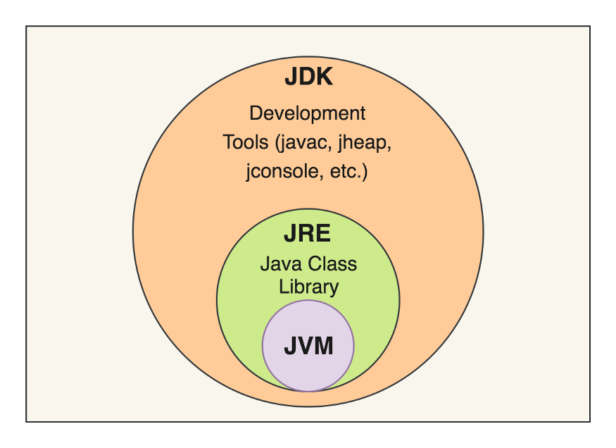

# 1. hét

## Az objektumorientált paradigma alapfogalmai. Osztály, objektum, példányosítás

*„Az egyetlen változatlan, az örökös változás”* – Tankcsapda: Számolj vissza 

Minden szoftver fejlesztése során fel kell készülni a változások minél hatékonyabb és minél kisebb kockázattal való kezelésére. Erre ad megoldást a **modularitás**. Ahelyett, hogy egy nagy függvényt írnánk, felbonthatjuk a rendszerünket kisebb felelősségi körrel rendelkező atomi modulokra. Egy modul elrejti a belső implementációját és lehetővé teszi, hogy az őt használó más modulok egyedül a publikus interfészétől függhessenek. 

Modulok létrehozásakor **magas kohézióra** (high cohesion: egy modulban szereplő dolgok szorosan összefüggenek) és **lazán csatoltságra** (low coupling: modulok között minél kisebb a függőség) törekszünk. Az objektumorientált paradigma elemi programozás nyelvi szintre hozta le a modul koncepcióját. 

Az **OO paradigma** célja az absztrakciós szint növelése, a valós világ könnyebb modellezése érdekében. Az adatmodell (min, statikus) és a funkcionális modell (mit, dinamikus) szoros kapcsolatban van, nem elválasztható. 

Az **osztály** egy absztrakt nyelvi eszköz, az absztrakt adattípust valósítja meg. Az implementációt is osztályok alkotják. **Attribútumok** (az adatszerkezet leírására) és **metódusok** (a viselkedés definiálására) jellemzik. 

Az **objektum** egy konkrét nyelvi eszköz. Példányosítás útján jön létre. Egy osztály alapján több objektumot is létre lehet hozni. Egy osztály minden példánya azonos struktúrával és viselkedési móddal rendelkezik. Objektumoknak van: 

* **Címe**: az a memória cím (memóriaterület), ahol az adat struktúrájának elemei elhelyezkednek 
* **Állapota**: a memóriában tárolt értékek, lefoglalás után ez a kezdőállapotot jelenti (példányosítás után) 
* **Öntudata**: minden objektum magával azonos és minden mástól különböző, rendelkeznek objektum azonosítóval (object identifier: OID) 
* **Élettartama**: a példányosítástól a példányhoz tartozó memória terület felszabadításáig tartó idő, programozási nyelvtől függően kezelheti a programozó, vagy történhet automatikusan (pl. Java esetén), ha már nem történik több hivatkozás az adott objektumra 

Az **egységbezárás** elve azt jelenti, hogy az adatstruktúrákat és az adott struktúrájú adatokat kezelő függvényeket (metódusokat) kombináljuk. Azokat egy egységként kezeljük, és elzárjuk őket a külvilág elől. Az így kapott egységeket objektumoknak nevezzük. 

Az attribútumok és metódusok lehetnek példány vagy osztály szintűek. 

**Példányszintű attribútum**: minden példány esetén megjelenik a memóriában, meghatározza az objektum aktuális állapotát 

**Osztályszintű attribútum**: nem tárolódik minden példány esetén, csak az osztály szintjén 

**Példányszintű metódus**: a példányok viselkedését határozza meg, mindig egy aktuális példányon operálnak 

**Osztályszintű metódus**: nincs aktuális példány, az osztályhoz kötődnek 

Metódusok osztályozása: 

**Beállító**: példányszintű beállító metódus esetén az aktuális objektum állapotát módosítja, osztályszintű beállító metódus esetén osztályszintű attribútumok beálíltására szolgál 

**Lekérdező**: aktuális példányok, illetve osztályok attribútumait kérik le, függvény jellegű metódusok 

**Konstruktor**: példányok létrehozására szolgál, illetve az objektumok kezdőállapotának beállítására 

## Alap Java nyelvi ismeretek 

### Gyakorlaton bemutatott parancsok a Hello World Java kódon: 
* `java –version` (Java verzió kiíratása) 
* `java Main.java` (Main.java osztály lefuttatása) 
* `javac Main.java` (Main.java osztály lefordítása köztes bájtkódra) 
* `Javap -c Main.class` (Lefordított Main.class osztály visszafejtése) 
* `java -cp . Main` (Lefordított Main.class osztály lefuttatása) 