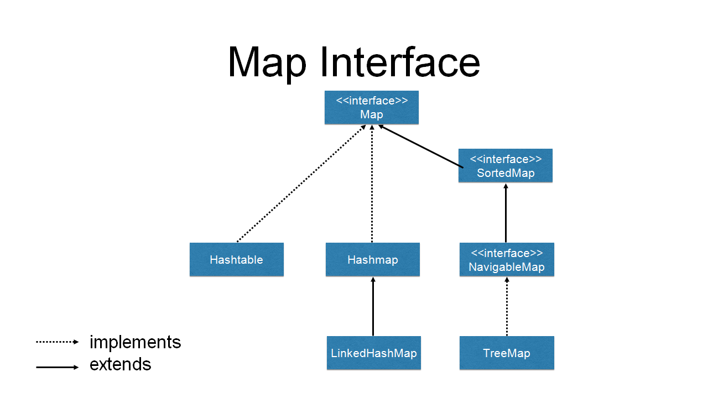

# 5. hét

## Interfészek. Kollekciók.

### Bevezetés
Különböző programozói feladatok vagy problémák megoldása közben elkerülhetetlen, hogy egyszerre nem csak egy, hanem több
objektumot is tudnom kell kezelni, tárolni. Erre egy megoldást adhat a tömb (array), ami a legtöbb nyelvben, így Java-ban
is natívan elérhető. Azonban bizonyos esetekben más adatszerkezetek sokkal kényelmesebb és jobb megoldást adhatnak. Mint
például:
* Halmaz (set)
** Adott típusú elemek tárolására való
** Homogén
** Dinamikus
** Nem értelmez sorrendet az elemek között
* Lista (list)
** Adott típusú elemek tárolására való
** Homogén
** Dinamikus
** Értelmez sorrendet az elemek között
* Map (map)
** Kulcs-érték párok tárolására való
** Homogén
** Dinamikus
** Nem értelmez sorrendet a kulcs-érték párok között

A következő fejezetekben az említett adatszerkezetek fogjuk megismerni Java-ban.

### Collection interfész és implementációi

#### ArrayList
* A háttérben egy tömböt használ az elemek tárolására
* Az ArrayList módosítása (elemek törlése, hozzáadása) költséges lehet
* Az elemek elérése indexek alapján közvetlenül történik, így az olvasás nagyon gyors
* Ha tudjuk pontosan hány elemet szeretnénk tárolni, és nincs szükség gyakori módosításra, akkor egy jó választás lehet

#### LinkedList
* A háttérben egy kétirányból lácolt listát használ az elemek tárolására
* A módosítás kevésbé időigényes az ArrayList implementációhoz képest
* Az elemek elérése a láncolt lista bejárásán alapul, így ez lassabb lehet az ArrayList-hez képest, illetve egy elem
tárolása is költségesebb
* Ha nem tudjuk pontosan mennyi elemet szeretnénk tárolni, és szükséges a listánk gyakori módosítása, akkor a LinkedList
egy jó választás lehet

#### HashSet
* A háttérben HashMap-et használ az adatok tárolására
* Gyorsabb mint a TreeSet
* Az elemeket nem rendezett módon tárolja

#### TreeSet
* A háttérben TreeMap-et használ az adatok tárolására
* Lassabb mint a HashSet
* Az elemeket rendezetten tárolja, így támogat higher(), floor() és ceiling() műveleteket

### Map interfész és implementációi

#### HashMap
* A Hashtable egy általánosabb implementációja
** Tud null kulcsokat és értékeket kezelni
** Azonban a Hashtable implementtációval ellentétben nem szálbiztos
* Nem értelmez sorrendet a kulcs-érték párok között
* Szükséges az equals() és a hashCode() megfelelő implementációja a kulcs típusokra
* Általános célú Map implementáció, gyors adateléréssel, de nem szálbiztos
** Szálbiztos változata a ConcurrentHashMap

#### LinkedHashMap
* A HashMap és a LinkedList implementációk keveréke
* Tud null kulcsokat és értékeket kezelni
* Értelmes sorrendet az elemek között (beszúrás vagy lekérdezés sorrendje)
* Nem szálbiztos
* Szükséges az equals() és a hashCode() megfelelő implementációja a kulcs típusokra
* Akkor érdemes használni, ha számít a beszúrás vagy az elérés sorrendje

#### TreeMap
* Piros Fekete bináris fa implementációt használ
* Nem tud null kulcsot kezelni minden esetben
* Értelmes sorrendet az elemek között (a kulcsok természetes sorrendje vagy egy megadott Comparator alapján)
* Nem szálbiztos
* Szükséges egy megfelelő Comparator megadása, vagy máskülönben a kulcsok természetes sorrendjét fogja használni
* Olyan esetekben érdemes használni, amikor fontos a rendezési vagy navigációs tulajdonság

## Funkcionális nyelvi elemek. Lambda kifejezések.