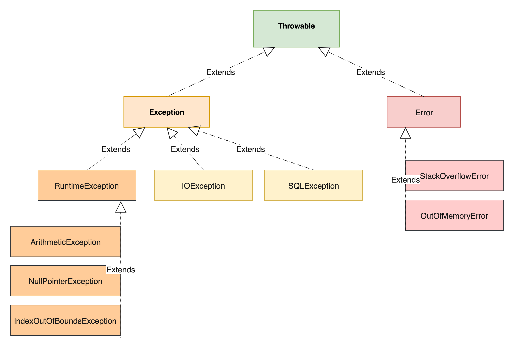

# 8. hét

Kivételkezelés és reflexió. A fordítást és a kódgenerálást támogató nyelvi elemek (annotációk, attribútumok).

## Kivételkezelés
A kivételkezelés segítségével felkészíthetjük a programunkat különböző kivételes események, esetleges hibák kezelésére.
A Java nyelvben a kivételek is speciális osztályok példányai. Minden kivétel ős osztálya a Throwable osztály, amely az
Object osztályból származik.

### Exception osztályhierarhia


#### Error
Az Error kivételek komoly problémák esetén dobódnak, melyeket jellemzően nem érdemes kezelni,
mivel már valószínűleg nem lehet helyreállítani a program futását.

Pl.: OutOfMemoryError, StackOverflowError

#### Exception
Olyan kivételeket, amelyeket érdemes kezelni. A fordító ki is kényszeríti, hogy minden Exception, vagy annak bármely
leszármazott osztályát (kivéve a RuntimeException kivételt és annak alosztályait) vagy lekezeljük, vagy dobjuk tovább
a hívási láncon. Ilyen kivételeket használunk, ha mindenféleképpen szeretnénk a hivó oldaltól kikényszeríteni egy adott
kivétel kezelését.

Pl.: IOException, SQLException

#### RuntimeException
Olyan kivételek, amelyeket érdemes lehet kezelni, de a fordító nem kényszeríti ki ezt. Jellemzően valamilyen programozói
hibára utalhatnak.

Pl.: NullPointerException, IndexOutOfBoundsException

### Checked és Unchecked exception
Az Error illetve a RuntimeException osztályok és az ők leszármazott osztályai Unchecked exception kivételeknek minősülnek,
hiszen a fordító nem kényszeríti ki ezeknek a kivételeknek a kezelését. Ellenben az Exception kivétel és az ő leszármazottjai
(kivéve a RuntimeException és annak leszármazottjai) Checked exception kivételnek minősülnek, mert őket explicit le kell
kezelni vagy tovább kell dobni és ezt az adott metódus fejében jelölnünk kell.

### Kivételkezelés szintaktikája

#### Throws
A `throws` kulcsszóval tudjuk a metódus fejében jelezni, hogy az adott metódus milyen kivételeket dobhat. Checked exception
lehetséges dobását muszáj jelezzük.
```java
public void doSomething() throws Exception {
    throw new Exception();
}
```

#### Try-Catch-Finally
Ezzel a szerkezettel kezelhetünk le kivételeket. A `try` kulcsszót követő blokkban kell meghívni azt a metódust, ami
kivételt dobhat.

Tetszőleges darabszámú `catch` ágat adhatunk meg. A `catch` ágak sorrendje azonban számít, mivel előre kell kerüljenek a
legspecifikusabb kivételek. Ez alapján mindíg csak a legspecifikusabb `catch` ág fog lefutni. Ezekben a `catch` ágakban
minden esetben érdemes kiíratni (lelogolni) az adott éppen lekezelt kivételt, mivel máskülönben elnyelnénk az adott
kivételt, ami nagy mértékben nehezítheti meg a dolgunkat, amikor debug-olni próbáljuk a programfutásunkat.

A `finally` kulcsszóval adhatunk meg egy olyan kód blokkot amely minden esetben le fog futni (akkor is ha volt kivétel és akkor is
ha nem). A `finally` ág használata opcionális, de hasznos lehet különböző erőforrások felszabadítására.
```java
public void doSomething() {
    try {
        ... // do something dangerous
    } catch (IOException e) {
        ... // the specific logic to recover the program execution
    } catch (Exception e) {
        ... // the specific logic to recover the program execution
    } finally {
        ... // the logic, which will always be called
    }
}
```

#### Try-With-Resources
Java 7-től vált elérhetővé ez a szerkezet. Kimondottan olyan esetekre találták ki amikor lezárandó erőforrásokkal kell
dolgoznunk. A `try` kulcsszó után zárójelben példányosíthatunk olyan objektumokat, amelyek megvalósítják az `AutoClosable`
interfészt. Az említett interfész definiál egy `close()` metódust, amely meg lesz hívva a JVM által automatikusan.
```java
public String readFirstLineFromFile(String path) throws IOException {
    try (BufferedReader br = new BufferedReader(new FileReader(path))) {
        return br.readLine();
    }
}
```

#### Throw
A `throw` kulcsszóval tudunk kivétel példányokat eldobni.
```Java
public void doSomething() {
    throw new IllegalArgumentException();
}
```

### Saját kivétel osztály létrehozása
Könnyedén hozhatunk létre saját (custom) kivételeket. Egyszerűen csak származtatnunk kell az Exception osztályt (ha
checked exception-t szeretnénk) vagy a RuntimeException osztályt (ha unchecked exception-t szeretnénk).

## Annotációk
Az annotációk segítségével különböző nyelvi elemeket (osztály, mező, metódus, paraméter, stb) tudunk megjelölni, vagy más
szóval megannotálni. Ezeket az annotációk szólhatnak a fejlesztőknek, de akár a fordító vagy esetleges posztprocesszorok
is feldolgozhatják.

Ilyen annotációra egy példa a már korábban is látott `@Override`, ami azt jelzi a fordítónak, hogy az adott metódust
(amire rátettük) azzal a céllal hoztuk létre, hogy az ősosztály egy metódusát felüldefiniáljuk.
```java
public class Car {
    @Override
    public String toString() {
        return "Car";
    }
}
```

### Saját Annotáció létrehozása
Saját annotációt az alábi módon hozhatunk létre:
```java
@Retention(RetentionPolicy.RUNTIME)
@Target({ElementType.TYPE, ElementType.METHOD})
public @interface MyAnnotation {
	String value() default "";
	int number() default 0;
}
```
Az annotációknak lehetnek attribútumai. Az előző példában a `@MyAnnotation` annotációnak két attribútuma van, a `value`
és a `number`. EZeknek az attribútumoknak a típusa az alábbiak lehetnek: primitív típus (int, long, stb), String, Class,
Enum, Annotáció vagy ilyen típusú tömb.

### @Retention
A `@Retention` egy speciális anniotáció, amit annotációk definiálására használunk. Azt mondja meg, hogy az adott annotáció
meddig lesz elérhető, meddig lesz megtartva. Egy attribútuma van ami egy RetentionPolicy Enum, melynek három lehetséges
értéke van:
* SOURCE: az adott annotáció a fordítás során elveszik, a lefordított `.class` állományban már nem lesz benne
* CLASS: a lefordított `.class` állományba még belekerül, de futásidőben a JVM által már nem lesz látható
* RUNTIME: a lefordított `.class` állományba bele fog kerül, és futásidőben a JVM által lekérdezhető lesz

### @Target
A `@Target` egy másik speciális anniotáció, amit szintén annotációk definiálására használunk. Segítségével megadhatjuk,
hogy milyen elemekre lehet az adott annotációt rátenni. Pl.: TYPE, FIELD, METHOD, PARAMETER stb. Az előző példában
szereplő `@MyAnnotation` annotációt tehát osztályokra és metódusokra lehet rátenni.

### Annotációk használata
Az előző példában létrehozott `@MyAnnotation` annotációt az alábbi módokon használhatjuk és paranméterezhetjük:
```java
@MyAnnotation("asd")
public class MyClass {
	@MyAnnotation(number = 2)
	@Override
	public boolean equals(Object obj) {
		return super.equals(obj);
	}
}
``` 

## Reflexió

* Lehetővé teszi objektumok tulajdonságainak futási idejű vizsgálatát,
módosítását. Például:
** Mezők típusának, módosítóinak, értékeinek, annotációinak vizsgálata, értékeinek módosítása
** Metódusok paraméter-típusainak, visszatérési típusainak, módosítóinak vizsgálata, a metódus hívása
** Konstruktor paraméter-típusainak, visszatérési típusainak, módosítóinak vizsgálata, új példány létrehozása

### A `Class` osztály

* A Java Reflection API "belépési pontja"
* A futó Java alkalmazás osztályainak és interfészeinek reprezentálására használható.
    * Az enum típus osztály
    * Az annotáció típus interfész
    * A tömb típus osztály
    * A primitív típusok és a `void` is reprezentálható a `Class` osztállyal.
* Általában a JVM példányosítja az osztály betöltésekor, nincs publikus konstruktora.
* Egy adott osztályt reprezentáló `Class` példányhoz a következőképpen juthatunk hozzá:
    * Ha `Foo` egy osztály, akkor a `Foo.class` használható
    * Ha `fooInstance` egy `Foo` osztályból példányosított objektum, akkor a `fooInstance.getClass()` használható.
    * Ha `com.epam.training.Foo` egy osztály, akkor a `Class.forName("com.epam.training.Foo")` használható

### Egy osztály tulajdonságainak vizsgálata

Példa az Oracle Java Tutorial [Examining Class Modifiers and Types](https://docs.oracle.com/javase/tutorial/reflect/class/classModifiers.html)
fejezetében.

### Egy osztály mezőinek, metódusainak, konstruktorainak lekérése

#### Mezők lekérdezése

| Metódus neve      | Listát vagy egyetlen példányt ad? | Örökölt mezőket is figyelembe vesz? | `private` mezőket is figyelembe vesz? |
| ----------------- | --------------------------------- | ----------------------------------- | ------------------------------------- |
| getDeclaredField  | Egyetlen példányt                 | nem                                 | igen                                  |
| getField          | Egyetlen példányt                 | igen                                | nem                                   |
| getDeclaredFields | Listát                            | nem                                 | igen                                  |
| getFields         | Listát                            | igen                                | nem                                   |

#### Metódusok lekérdezése

| Metódus neve       | Listát vagy egyetlen példányt ad? | Örökölt metódusokat is figyelembe vesz? | `private` metódusokat is figyelembe vesz? |
| ------------------ | --------------------------------- | --------------------------------------- | ----------------------------------------- |
| getDeclaredMethod  | Egyetlen példányt                 | nem                                     | igen                                      |
| getMethod          | Egyetlen példányt                 | igen                                    | nem                                       |
| getDeclaredMethods | Listát                            | nem                                     | igen                                      |
| getMethods         | Listát                            | igen                                    | nem                                       |

#### Konstruktorok lekérdezése

| Metódus neve            | Listát vagy egyetlen példányt ad? | `private` konstruktorokat is figyelembe vesz?  |
| ----------------------- | --------------------------------- |  --------------------------------------------- |
| getDeclaredConstructor  | Egyetlen példányt                 |  igen                                          |
| getConstructor          | Egyetlen példányt                 |  nem                                           |
| getDeclaredConstructors | Listát                            |  igen                                          |
| getConstructors         | Listát                            |  nem                                           |

### Egy mező tulajdonságainak vizsgálata, módosítása

#### Mező típusának vizsgálata

Példa az Oracle Java Tutorial [Obtaining Field Types](https://docs.oracle.com/javase/tutorial/reflect/member/fieldTypes.html)
fejezetében.

#### Mező módosítóinak vizsgálata

```java
class SomeClass {
    public static void main(String[] args) throws NoSuchFieldException {
        Field field = SomeInnerClass.class.getField("someValue");
        int modifiers = field.getModifiers();
        System.out.println(Modifier.isPublic(modifiers));
        System.out.println(Modifier.isPrivate(modifiers));
        System.out.println(Modifier.isStatic(modifiers));
        System.out.println(Modifier.isFinal(modifiers));
    }

    private static class SomeInnerClass {
        public final int someValue = 42;
    }
}
```

#### Mezők értékének lekérése, módosítása

```java
class SomeClass {
    public static void main(String[] args) throws NoSuchFieldException, IllegalAccessException {
        Field field = SomeOtherClass.class.getDeclaredField("someValue");
        SomeOtherClass otherClassInstance = new SomeOtherClass();
        field.setAccessible(true);
        System.out.println(field.get(otherClassInstance));
        field.setInt(otherClassInstance, 24);
        System.out.println(otherClassInstance.toString());
    }
}

class SomeOtherClass {
    private final int someValue = new Integer(42);

    @Override
    public String toString() {
        return "SomeOtherClass{" +
                "someValue=" + someValue +
                '}';
    }
}
```

### Metódusok hívása

```java
class TestRunner {
    public static void main(String[] args) {
        TestCases testCases = new TestCases();
        List<Method> testMethods = Arrays.stream(testCases.getClass().getDeclaredMethods())
                .filter(method -> method.getName().startsWith("test"))
                .collect(Collectors.toList());
        testMethods.forEach(method -> {
            try {
                method.invoke(testCases);
                System.out.println("Test passed: " + method.getName());
            } catch (InvocationTargetException ex) {
                System.out.println("Test failed: " + method.getName());
                System.out.println("Due to " + ex.getCause().toString());
            } catch (IllegalAccessException e) {
                e.printStackTrace(System.out);
            }
        });
    }
}

class TestCases {

    public void testSomethingShouldDoThings() {
        // Given ...

        // When ...

        // Then
        throw new RuntimeException("Some assertion failed");
    }

    public void testSomethingElseShouldDoThings() {
        // Given ...

        // When ...

        // Then all is good
    }
}
```

### Példányosítás

```java
class SomeClass {
    public static void main(String[] args) throws NoSuchMethodException, IllegalAccessException, InvocationTargetException, InstantiationException {
        Constructor<SomeOtherClass> constructor = SomeOtherClass.class.getDeclaredConstructor(int.class);
        SomeOtherClass instance = constructor.newInstance(42);
        System.out.println(instance.toString());
    }
}

class SomeOtherClass {
    private final int someValue;

    public SomeOtherClass(int someValue) {
        this.someValue = someValue;
    }

    @Override
    public String toString() {
        return "SomeOtherClass{" +
                "someValue=" + someValue +
                '}';
    }
}
```

# XP feladat

Implementálj egy Java nyelven írt parancssori Web Shop alkalmazást, amely az alábbi funkcionalitásokat teszi
elérhetővé:

Admin parancsok - 30 XP
 - Admin paranccsal be tudok importálni Termék Típusok listáját egy CSV fájlból az alkalmazásba
 - Admin paranccsal lehetséges Termék Típus létrehozása és törlése
 - Admin paranccsal lehetséges Termék Típusok listázása
 - Admin paranccsal be tudok importálni Termékek listáját egy CSV fájlból az alkalmazásba
 - Admin paranccsal lehetséges Termék létrehozása és törlése
 - Admin paranccsal lehetséges Termékek listázása

Ügyfél parancsok - 20 XP
 - Vásárlók listázhatják a Termék Típusokat
 - Vásárlók a kosarukba tehetnek Termékeket, tetszőleges mennyiségben
 - Vásárlók megvásárolhatják a korábban a kosarukba tett termékeket
	- A megvásárolt konkrét Termékek kikerülnek a nyilvántartásból
	- A megvásárolt tételek kiíratásra kerülnek és egy végösszeg is megjelenik

Non-funkcionális követelmény: Írj annyi egység tesztet (Unit Test) amennyit csak tudsz - 50 XP

Termék Típus:
 - Kategória
 - Márka
 - Típus
 - Ár (forintban)
 
Termék:
 - Termék Típus
 - Sorozatszám
 
Kosár:
 - Termék Típusok (a megvásárolni kívánt termékek)